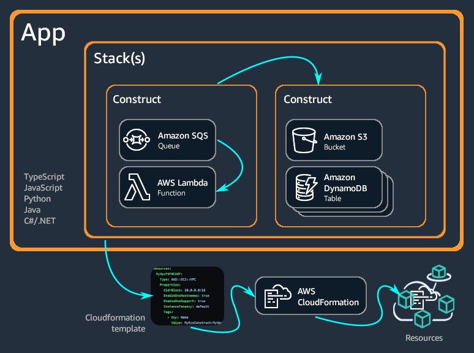

# CDK 中文勝經

給那些想入門 CDK，卻不知道在從啥的人

立志成為 CDK 界的鳥哥 ><

## Purpose
跟隨 AWSLC 一起探索 CDK 的魅力吧！

## CDK Architecture

## Resources

* [Github Repository](https://github.com/aws-samples/aws-cdk-examples)
*  [CDK Toolkit](https://docs.aws.amazon.com/cdk/v2/guide/cli.html)(used to interact with CDK APP)
*  [Construct Library](https://docs.aws.amazon.com/cdk/v2/guide/constructs.html) (offers constructs for each AWS service, many with "rich" APIs that provide high-level abstractions. The aim of the AWS Construct Library is to reduce the complexity and glue logic required when integrating various AWS services to achieve your goals on AWS.)
*  The Construct Programming Model -

The Construct Programming Model (CPM) extends the concepts behind the AWS CDK into additional domains. Other tools using the CPM include:

* [CDK for Terraform](https://www.terraform.io/docs/cdktf/index.html)(cdktf)
* [CDK for Kubernetes](https://cdk8s.io/)（cdk8s)
* [Projen](https://github.com/projen/projen)

## Concepts

### Construct

你可以把它理解成你在 AWS 單一個一個資源或是服務，如你在 AWS launch 了一台 EC2 instance，我們就可以把它理解成一個 **construct** 的概念。但你以為就這麼單純嗎？>< 

變相來說，construct 也是可以理解成 "一些 AWS 資源和服務串接組合而成的一個抽象概念，如若是我將 API Gateway 與 Lambda 做連接"，我也可以將其概念理解成 construct 的概念。

但現在，其實你無需去自己將 construct 建立起來，你可以透過 AWS Construct Library 來去達到你要的服務建置需求，你可以在 [Construct Hub](https://constructs.dev/search?q=&cdk=aws-cdk&cdkver=2&sort=downloadsDesc&offset=0) 找到各種語言建立好的模組，並且你可以將它納入至你的服務做使用。

### Construct Layer 

* Layer 1:
All resource are in `aws-cdk-lib`.

* Layer 2:
* Layer 3
### App

### CDK Lifecycle

* Construct --> Prepare --> Validate --> Synthesize 

## Prerequisites (在開發前你必須知道的事情)

其實 AWS CDK 不論哪種語言，都是用 Node.js 來把後端打造起來的！！ 可以參考這個[連結](https://github.com/nodejs/release#release-schedule)看一下 Node.js 的開發進度條

## Bootstrapping (很重要)

Bootstrapping - https://docs.aws.amazon.com/cdk/v2/guide/bootstrapping.html

## 開始你的 CDK 專案

### 關於代碼參數的疑慮

Bucket is the first construct that we've seen, so let's take a closer look. Like all constructs, the Bucket class takes three parameters.

* scope: Tells the bucket that the stack is its parent: it is defined within the scope of the stack. You can define constructs inside of constructs, creating a hierarchy (tree). Here, and in most cases, the scope is this (self in Python), meaning the construct that contains the bucket: the stack.

* Id: The logical ID of the Bucket within your AWS CDK app. This (plus a hash based on the bucket's location within the stack) uniquely identifies the bucket across deployments. This way, the AWS CDK can update it if you change how it's defined in your app. Here, it's "MyFirstBucket." Buckets can also have a name, which is separate from this ID (it's the bucketName property).

* props: A bundle of values that define properties of the bucket. Here we've defined only one property: versioned, which enables versioning for the files in the bucket.

## Typescript 宣告變數規則

* 駝峰式命名 - 如第一個字一定小寫，跟在後面的詞組開頭一定大寫，ex: removal"P"olicy
* 不用特別背誦參數名稱，通常你輸入時，'aws-lib-cdk' 會自動幫你搜尋